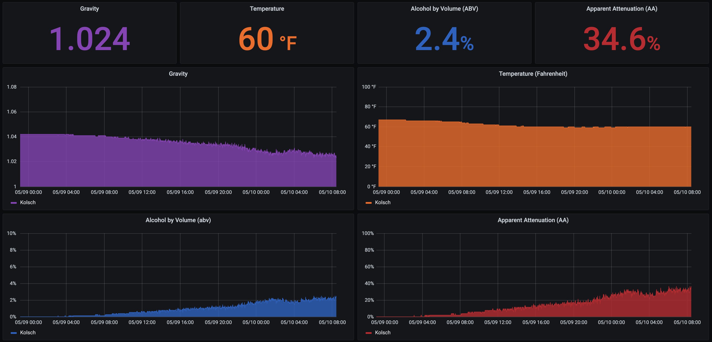
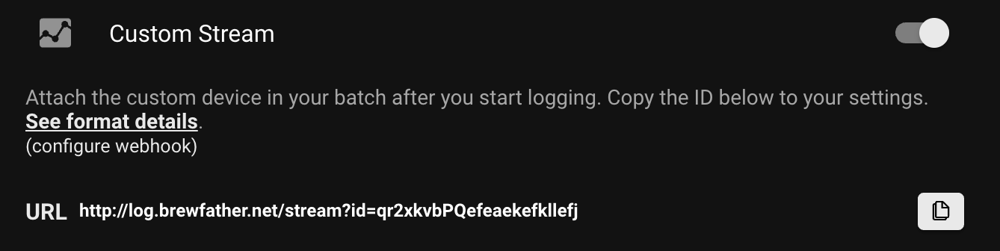
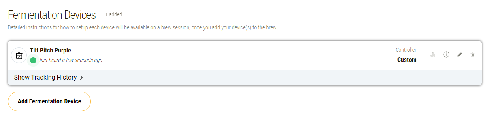
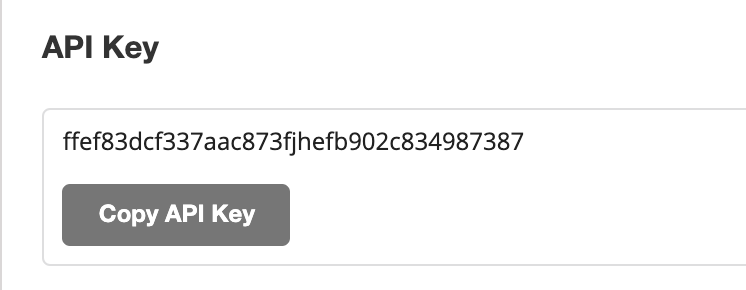

# Pitch (Tilt Hydrometer tool)


Pitch is an unofficial replacement for Tilt Hydrometer mobile apps and TiltPi software.  Tilt hardware is required.  It is designed to be easy to use and integrated with other tools like Promethues and InfluxDB for metrics, or any generic third party source using webhooks.



# Why

The Tilt hardware is impressive, but the mobile apps and TiltPi are confusing and buggy.  This project aims to provide a better more reliable solution, but is focused on more tech-savvy brewers than the official Tilt projects.  

# Features

The following features are implemented, planned, or will be investigated in the future:

* [x] Track multiple Tilts at once
* [x] Calibrate Tilt readings with known good values
* [x] Prometheus Metrics
* [x] Tilt status log file (JSON)
* [X] InfluxDB 1.0 and 2.0 Metrics 
* [X] Multiple logging and metric sources simultaneously
* [X] Webhooks for supporting generic integrations (similar to Tilt's Cloud Logging feature)
* [X] Gravity, original gravity, ABV, temperature and apparent attenuation
* [X] Custom Beer/brew names (e.g. purple tilt = Pumpkin Ale)
* [X] Brewing Cloud Services (Brewfather, Brewer's Friend, Grainfather, more can be requested!)
* [ ] Google Sheets (using any Google Drive)

# Installation

Pitch will only work on Linux, with libbluetooth-dev installed.  [See examples/install/prereq.sh](https://github.com/linjmeyer/tilt-pitch/blob/master/examples/install/prereqs.sh) for 
an example of how to do this using apt-get (Ubuntu, Raspberry Pi, etc).  

After setting up prereqs install using: `pip3 install tilt-pitch`
Pitch can be run using: `python3 -m pitch`

## Configuration

Custom configurations can be used by creating a file `pitch.json` in the working directory you are running Pitch from.

| Option                       | Purpose                      | Default               | Example               |
| ---------------------------- | ---------------------------- | --------------------- | --------------------- |
| `queue_size` (int) | Max queue size for all Tilt event broadcasts.  Events are removed from the queue once all enabled providers have handled the event.  New events are dropped when the queue is maxed.  | `3` | No example yet (PRs welcome!) |
| `queue_empty_sleep_seconds` (int) | Time in seconds Pitch will sleep when the queue reaches 0. The higher the value the less CPU time Pitch uses.  Can be 0 or negative (this disables sleep and Pitch will always run). | `1` | No example yet (PRs welcome!) |
| `temp_range_min` (int) | Minimum temperature (Fahrenheit) for Pitch to consider a Tilt broadcast to be valid. | `32` | No example yet (PRs welcome!) |
| `temp_range_max` (int) | Maximum temperature (Fahrenheit) for Pitch to consider a Tilt broadcast to be valid. | `212` | No example yet (PRs welcome!) |
| `gravity_range_min` (int) | Minimum gravity for Pitch to consider a Tilt broadcast to be valid. | `0.7` | No example yet (PRs welcome!) |
| `gravity_range_max` (int) | Maximum gravity for Pitch to consider a Tilt broadcast to be valid. | `1.4` | No example yet (PRs welcome!) |
| `webhook_urls` (array) | Adds webhook URLs for Tilt status updates | None/empty | No example yet (PRs welcome!) |
| `webhook_limit_rate` (int) | Number of webhooks to fire for the limit period (per URL) | 1 | No example yet (PRs welcome!) |
| `webhook_limit_period` (int) | Period for rate limiting (in seconds) | 1 | No example yet (PRs welcome!) |
| `log_file_path` (str) | Path to file for JSON event logging | `pitch_log.json` | No example yet (PRs welcome!) |
| `log_file_max_mb` (int) | Max JSON log file size in megabytes | `10` | No example yet (PRs welcome!) |
| `prometheus_enabled` (bool) | Enable/Disable Prometheus metrics | `true` | No example yet (PRs welcome!) |
| `prometheus_port` (int) | Port number for Prometheus Metrics | `8000` | No example yet (PRs welcome!) |
| `influxdb_hostname` (str) | Hostname for InfluxDB database | None/empty | No example yet (PRs welcome!) |
| `influxdb_port` (int) | Port for InfluxDB database | None/empty | No example yet (PRs welcome!) |
| `influxdb_database` (str) | Name of InfluxDB database | None/empty | No example yet (PRs welcome!) |
| `influxdb_username` (str) | Username for InfluxDB | None/empty | No example yet (PRs welcome!) |
| `influxdb_password` (str) | Password for InfluxDB | None/empty | No example yet (PRs welcome!) |
| `influxdb_batch_size` (int) | Number of events to batch.  Data is not saved to InfluxDB until this threshold is met | `10` | No example yet (PRs welcome!) |
| `influxdb2_url` (str) | URL of InfluxDB 2.0 database | None/empty | `http://localhost:8086` |
| `influxdb2_token` (str) | Token for writing to InfluxDB 2.0 | None/empty | a base64 encoded string |
| `influxdb2_org` (str) | Org for InfluxDB 2.0 database | None/empty | `org_name` |
| `influxdb2_bucket` (str) | Bucket to write data to in InfluxDB 2.0 | None/empty | `bucket_name`
| `influxdb_timeout_seconds` (int) | Timeout of InfluxDB reads/writes | `5` | No example yet (PRs welcome!) |
| `brewfather_custom_stream_url` (str) | URL of Brewfather Custom Stream | None/empty | No example yet (PRs welcome!) |
| `grainfather_custom_stream_urls` (dict) | Dict of color (key) and URLs (value) | None/empty | [Example config](examples/grainfather/pitch.json) |
| `grainfather_temp_unit` (str) | Temperature unit `F` or `C` for Grainfather | `F` |  [Example config](examples/grainfather/pitch.json) |
| `brewersfriend_api_key` (str) | API Key for Brewer's Friend | None/empty | No example yet (PRs welcome!) |
| `taplistio_url` (str) | URL of Taplist.io Tilt reporting webhook | None/empty | No example |
| `{color}_name` (str) | Name of your brew, where {color} is the color of the Tilt (purple, red, etc) | Color (e.g. purple, red, etc) | No example yet (PRs welcome!) |
| `{color}_original_gravity` (float) | Original gravity of the beer, where {color} is the color of the Tilt (purple, red, etc) | None/empty | No example yet (PRs welcome!) |
| `{color}_temp_offset` (int) | Temperature offset to calibrate Tilt temperatures with a secondary reading [See Calibration](#Calibration) | 0 | No example yet (PRs welcome!) |
| `{color}_gravity_offset` (float) | Gravity offset to calibrate Tilt temperatures with a secondary reading [See Calibration](#Calibration)  | 0 | No example yet (PRs welcome!) |

## Rate Limiting and Batching

A single Tilt can emit several events per second.  To avoid overloading integrations with data events are queued with a max queue size set via the `queue_size`
configuration parameter.  If new events are broadcast from a Tilt and the queue is full, they are ignored.  Events are removed from the queue once all enabled
providers have handled the event.  Additionally some providers may implement their own queueing or rate limiting.  InfluxDB for example waits until a certain 
queue size is met before sending a batch of events, and the Brewfather and Grainfather integrations will only send updates every fifteen minutes.

Refer to the above configuration and the integration list below for details on how this works for different integrations.

## Calibration

You can calibrate temperature and gravity for each Tilt by color.  To do this stop Pitch if it is running in the background, then run the following command:

`pitch --calibrate={color} --actual-temp=70 --actual-gravity=1.060`

Pitch will run for 5 seconds, and log any readings from the color given along with recommended offsets to gravity and temperature.  These can be put in the `pitch.json`
config file to calibrate the Tilt.  Recommendations will be positive when a Tilt is reading low, but negative when a Tilt is reading high.

Example output:

```
pitch --calibrate=purple --actual-gravity=1.070 --actual-temp=50
purple: gravity=1.035, gravity_offset=0.03500000000000014; temp_f=70, temp_offset=-20
purple: gravity=1.035, gravity_offset=0.03500000000000014; temp_f=70, temp_offset=-20
purple: gravity=1.035, gravity_offset=0.03500000000000014; temp_f=70, temp_offset=-20
```


## Running without a Tilt or on Mac/Windows

If you want to run Tilt on a non-linux system, for development, or without a Tilt you can use the `--simulate-beacons` flag to create fake
beacon events instead of scanning for Tilt events via Bluetooth.  

`python3 -m pitch --simulate-beacons`

# Integrations

* [Prometheus](#Prometheus-Metrics)
* [InfluxDb](#InfluxDB-Metrics)
* [Webhook](#Webhook)
* [JSON Log File](#JSON-Log-File)
* [Brewfather](#Brewfather)
* [Brewer's Friend](#BrewersFriend)
* [Grainfather](#Grainfather)
* [Taplist.io](#taplistio)

Don't see one you want, send a PR implementing [CloudProviderBase](https://github.com/linjmeyer/tilt-pitch/blob/master/pitch/abstractions/cloud_provider.py)

## Prometheus Metrics

Prometheus metrics are hosted on port 8000 by default.  No rate limiting or batching is used for Prometheus.  

For each Tilt the followed Prometheus metrics are created:

```
# HELP pitch_beacons_received_total Number of beacons received
# TYPE pitch_beacons_received_total counter
pitch_beacons_received_total{name="Pumpkin Ale", color="purple"} 3321.0

# HELP pitch_temperature_fahrenheit Temperature in fahrenheit
# TYPE pitch_temperature_fahrenheit gauge
pitch_temperature_fahrenheit{name="Pumpkin Ale", color="purple"} 69.0

# HELP pitch_temperature_celcius Temperature in celcius
# TYPE pitch_temperature_celcius gauge
pitch_temperature_celcius{name="Pumpkin Ale", color="purple"} 21.0

# HELP pitch_gravity Gravity of the beer
# TYPE pitch_gravity gauge
pitch_gravity{name="Pumpkin Ale", color="purple"} 1.035

# HELP pitch_alcohol_by_volume ABV of the beer
# TYPE pitch_alcohol_by_volume gauge
pitch_alcohol_by_volume{name="Pumpkin Ale", color="purple"} 5.63

# HELP pitch_apparent_attenuation Apparent attenuation of the beer
# TYPE pitch_apparent_attenuation gauge
pitch_apparent_attenuation{name="Pumpkin Ale", color="purple"} 32.32
```

## Webhook

Unlimited webhooks URLs can be configured using the config option `webhook_urls`.  Webhooks are rate limited per URL and per Tilt, the rate limit is configurable.

Webhooks are sent as HTTP POST with the following json payload:

```
{
    "name": "Pumpkin Ale",
    "color": "purple",
    "temp_fahrenheit": 69,
    "temp_celsius": 21,
    "gravity": 1.035,
    "alcohol_by_volume": 5.63,
    "apparent_attenuation": 32.32
}
```

## JSON Log File

Tilt status broadcast events can be logged to a json file using the config option `log_file_path`.  Each event is a newline.  Example file:

```
{"timestamp": "2020-09-11T02:15:30.525232", "name": "Pumpkin Ale", "color": "purple", "temp_fahrenheit": 70, "temp_celsius": 21, "gravity": 0.997, "alcohol_by_volume": 5.63, "apparent_attenuation": 32.32}
{"timestamp": "2020-09-11T02:15:32.539619", "name": "Pumpkin Ale", "color": "purple", "temp_fahrenheit": 70, "temp_celsius": 21, "gravity": 0.997, "alcohol_by_volume": 5.63, "apparent_attenuation": 32.32}
{"timestamp": "2020-09-11T02:15:33.545388", "name": "Pumpkin Ale", "color": "purple", "temp_fahrenheit": 70, "temp_celsius": 21, "gravity": 0.997, "alcohol_by_volume": 5.63, "apparent_attenuation": 32.32}
{"timestamp": "2020-09-11T02:15:34.548556", "name": "Pumpkin Ale", "color": "purple", "temp_fahrenheit": 70, "temp_celsius": 21, "gravity": 0.997, "alcohol_by_volume": 5.63, "apparent_attenuation": 32.32}
{"timestamp": "2020-09-11T02:15:35.557411", "name": "Pumpkin Ale", "color": "purple", "temp_fahrenheit": 70, "temp_celsius": 21, "gravity": 0.997, "alcohol_by_volume": 5.63, "apparent_attenuation": 32.32}
{"timestamp": "2020-09-11T02:15:36.562158", "name": "Pumpkin Ale", "color": "purple", "temp_fahrenheit": 70, "temp_celsius": 21, "gravity": 0.996, "alcohol_by_volume": 5.63, "apparent_attenuation": 32.32}
```

## InfluxDB Metrics

Metrics can be sent to an InfluxDB database.  See [Configuration section](#Configuration) for setting this up.  Pitch does not create the database
so it must be created before using Pitch.  Tilt events are sent to InfluxDB in batches, data is not sent until the batch size is reached.  The batch size
does not take color into account, so a batch of 50 purple events works the same as 25 purple and 25 red.

Each beacon event from a Tilt will create a measurement like this:

```json
{
    "measurement": "tilt",
    "tags": {
        "name": "Pumpkin Ale", 
        "color": "purple"
    },
    "fields": {
        "temp_fahrenheit": 70,
        "temp_celsius": 21,
        "gravity": 1.035,
        "alcohol_by_volume": 5.63,
        "apparent_attenuation": 32.32
    }
}
```  

and can be queried with something like:

```sql
SELECT mean("gravity") AS "mean_gravity" FROM "pitch"."autogen"."tilt" WHERE time > :dashboardTime: AND time < :upperDashboardTime: AND "name"='Pumpkin Ale' GROUP BY time(:interval:) FILL(previous)
```

## InfluxDB 2.0 Metrics

Metrics can be sent to an InfluxDB 2.0 database. See [Configuration section](#Configuration) for details on setting it up.  Pitch does not create the bucket.
This integration uses the same batching logic, output format, and configuration as the 1.0 integration above.

Shared configuration values:
- `influxdb_timeout`
- `influxdb_batch_size`

## Brewfather

Tilt data can be logged to Brewfather using their Custom Log Stream feature.  See [Configuration section](#Configuration) for setting this up in the Pitch config.  Brewfather
only allows logging data every fifteen minutes per Tilt which Pitch adheres to.  Devices will show as `PitchTilt{color}`.

To setup login into Brewfather > Settings > PowerUps > Enable Custom Stream > Copy the URL into your Pitch config



## Grainfather

Tilt data can be logged to Grainfather using their Custom Fermenation Device feature.  See [Configuration section](#Configuration) for setting this up in the Pitch config.  Grainfather only allows logging data ever fifteen minutes per Tilt which Pitch adheres to.  You must create a custom device per Tilt and save each URL into the Pitch config.

To setup login into Grainfather > My Equipment > Add Fermenation Device > Set the name and save > Press the "i" (info) button next to the device > Copy the URL into pitch.config



## Brewer's Friend

Tilt data can be logged to Brewer's Friend using their Custom App Stream feature.  See [Configuration section](#Configuration) for setting this up in the Pitch config.  Brewer's Friend
only allows logging data every fifteen minutes per Tilt which Pitch adheres to.  Devices will show as `Pitch-Tilt-{color}` as custom devices (they will not appear as Tilts).

To setup login into Brewer's Friend > Profile > Integrations > Copy Api Key



## Taplist.io

Tilt data can be logged to [Taplist.io](https://taplist.io/) using the Tilt Integration feature.

To setup, log into Taplist.io and visit _Account_ > _Integrations_ > _Tilt Hydrometer_. Copy the _Webhook URL_ value into your Pitch config as `taplistio_url`.

# Examples

See the examples directory for:

* InfluxDB Grafana Dashboard
* Running Pitch as a systemd service
* pitch.json configuration file

# Other

## Buy me a coffee (beer)


If you like Pitch, feel free to coffee (or a beer) here: https://www.buymeacoffee.com/linjmeyer

## Name

It's an unofficial tradition to name tech projects using nautical terms.  Pitch is a term used to describe the tilting/movement of a ship at sea.  Given pitching is also a brewing term, it seemed like a good fit.
