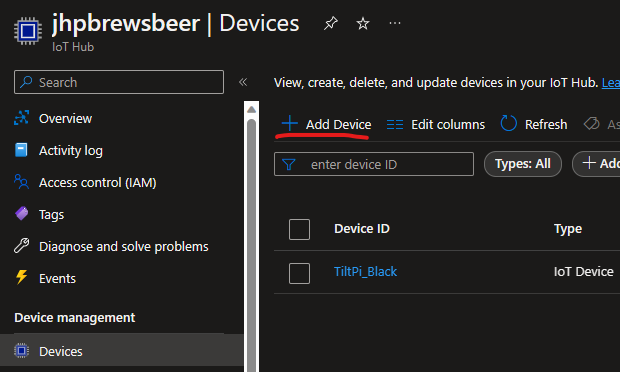
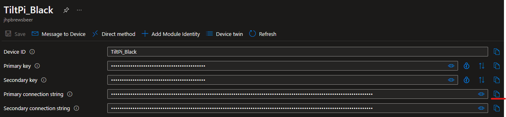

## Connect Pitch to Azure IoT Hub

1. Create new IoT hub (e.g. using the free tier with 8k messages per day)
1. Create new IoT device
    
1. Copy device key
    
1. Use copied key and optionally configure rate limit according to your selected tier!

```json
{
    "azure_iot_hub_connectionstring": "HostName=jhpbrewsbeer.azure-devices.net;DeviceId=TiltPi_Black;SharedAccessKey=...",
    "azure_iot_hub_limit_rate": 8000,
    "azure_iot_hub_limit_period": 1296000
}
```
